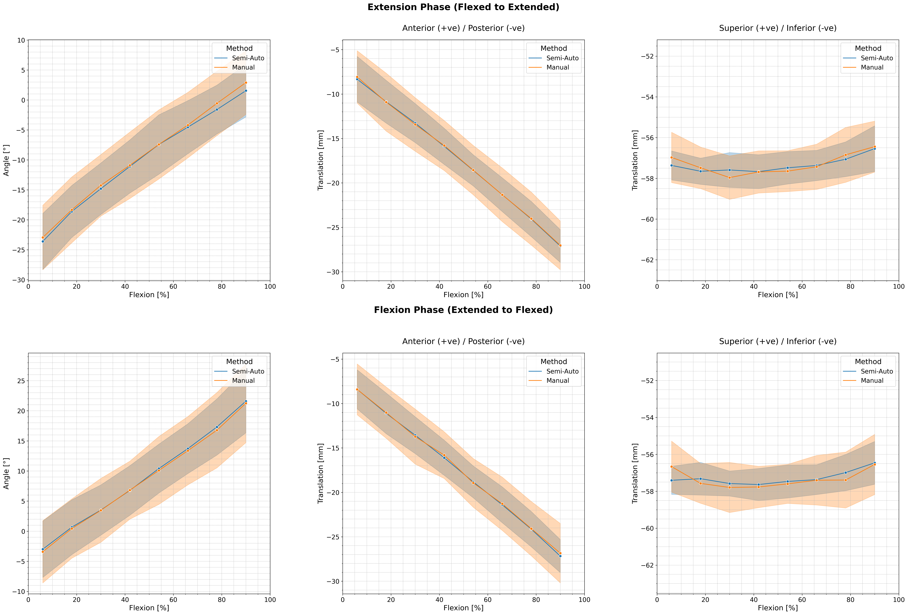

Changes from minimum to maximum flexion (with standard deviations):
1. Extension Phase - Angle:
   Manual:
     Start: -4.05 ± 5.85 °
     End: 20.94 ± 5.74 °
     Change: 24.99 ± 8.20 °
   Semi-Auto:
     Start: -2.73 ± 4.76 °
     End: 21.37 ± 5.34 °
     Change: 24.10 ± 7.15 °

2. Extension Phase - AP Translation:
   Manual:
     Start: -8.07 ± 2.95 mm
     End: -27.03 ± 2.74 mm
     Change: -18.95 ± 4.03 mm
   Semi-Auto:
     Start: -8.33 ± 2.57 mm
     End: -27.10 ± 1.85 mm
     Change: -18.78 ± 3.16 mm

3. Extension Phase - IS Translation:
   Manual:
     Start: -56.97 ± 1.24 mm
     End: -56.44 ± 1.25 mm
     Change: 0.53 ± 1.76 mm
   Semi-Auto:
     Start: -57.37 ± 0.71 mm
     End: -56.54 ± 1.12 mm
     Change: 0.82 ± 1.33 mm

4. Flexion Phase - Angle:
   Manual:
     Start: -3.41 ± 5.17 °
     End: 21.25 ± 6.53 °
     Change: 24.66 ± 8.34 °
   Semi-Auto:
     Start: -2.99 ± 4.69 °
     End: 21.60 ± 5.25 °
     Change: 24.59 ± 7.04 °

5. Flexion Phase - AP Translation:
   Manual:
     Start: -8.40 ± 2.86 mm
     End: -26.84 ± 3.35 mm
     Change: -18.44 ± 4.41 mm
   Semi-Auto:
     Start: -8.40 ± 2.20 mm
     End: -27.17 ± 1.86 mm
     Change: -18.77 ± 2.88 mm

6. Flexion Phase - IS Translation:
   Manual:
     Start: -56.66 ± 1.38 mm
     End: -56.55 ± 1.63 mm
     Change: 0.12 ± 2.14 mm
   Semi-Auto:
     Start: -57.41 ± 0.76 mm
     End: -56.46 ± 1.16 mm
     Change: 0.95 ± 1.39 mm

     
we cannot say with certainty the values for IS translations.      
     
     
     
