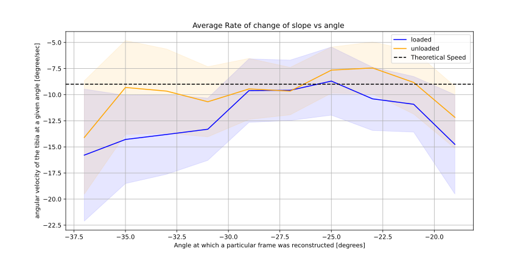
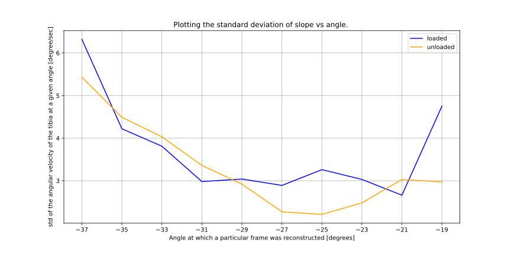

# first frame is extended 

2024-03-04 14:06:27,957 pymri        INFO     00: Reconstructing Frame using 72 spokes for angle -41 deg. Avg slope: -9.18°/s +/- 5.86°/s
2024-03-04 14:06:33,572 pymri        INFO     01: Reconstructing Frame using 396 spokes for angle -39 deg. Avg slope: -10.75°/s +/- 6.89°/s
2024-03-04 14:06:40,536 pymri        INFO     02: Reconstructing Frame using 681 spokes for angle -37 deg. Avg slope: -15.79°/s +/- 6.32°/s
2024-03-04 14:06:49,619 pymri        INFO     03: Reconstructing Frame using 915 spokes for angle -35 deg. Avg slope: -14.29°/s +/- 4.22°/s
2024-03-04 14:06:59,863 pymri        INFO     04: Reconstructing Frame using 989 spokes for angle -33 deg. Avg slope: -13.81°/s +/- 3.81°/s
2024-03-04 14:07:10,957 pymri        INFO     05: Reconstructing Frame using 1008 spokes for angle -31 deg. Avg slope: -13.31°/s +/- 2.98°/s
2024-03-04 14:07:21,915 pymri        INFO     06: Reconstructing Frame using 1405 spokes for angle -29 deg. Avg slope: -9.61°/s +/- 3.04°/s
2024-03-04 14:07:35,470 pymri        INFO     07: Reconstructing Frame using 1424 spokes for angle -27 deg. Avg slope: -9.58°/s +/- 2.89°/s
2024-03-04 14:07:49,173 pymri        INFO     08: Reconstructing Frame using 1586 spokes for angle -25 deg. Avg slope: -8.70°/s +/- 3.26°/s
2024-03-04 14:08:03,713 pymri        INFO     09: Reconstructing Frame using 1327 spokes for angle -23 deg. Avg slope: -10.40°/s +/- 3.03°/s
2024-03-04 14:08:16,981 pymri        INFO     10: Reconstructing Frame using 1268 spokes for angle -21 deg. Avg slope: -10.92°/s +/- 2.66°/s
2024-03-04 14:08:29,528 pymri        INFO     11: Reconstructing Frame using 916 spokes for angle -19 deg. Avg slope: -14.76°/s +/- 4.75°/s
2024-03-04 14:08:39,514 pymri        INFO     Output data:MRIArray(
2024-03-04 14:08:39,514 pymri        INFO       shape = (12, 528, 528)
2024-03-04 14:08:39,515 pymri        INFO       dims = ('repetition', 'line', 'read')
2024-03-04 14:08:39,515 pymri        INFO       type = float32
2024-03-04 14:08:39,515 pymri        INFO       header = 10 items
2024-03-04 14:08:39,515 pymri        INFO     )
2024-03-04 14:08:39,515 pymri        INFO     Writing output to file: AN_W_ai2_tgv_5e-2_neg_ngn.nii

just 24 degree ROM .. 
_________________________________
- for unloaded, without any offsets, it was starting at -38. super strange because for loaded, it started at -41 , albeit with only 72 spokes. 
- then, added os 1, and now we start at -37 which basically means that loaded has 2 frames more than unloaded. not what we would expect.. 

2024-03-04 14:15:43,856 pymri        INFO     00: Reconstructing Frame using 77 spokes for angle -37 deg. Avg slope: -14.10°/s +/- 5.43°/s
2024-03-04 14:15:50,208 pymri        INFO     01: Reconstructing Frame using 537 spokes for angle -35 deg. Avg slope: -9.31°/s +/- 4.49°/s
2024-03-04 14:15:58,121 pymri        INFO     02: Reconstructing Frame using 1012 spokes for angle -33 deg. Avg slope: -9.66°/s +/- 4.03°/s
2024-03-04 14:16:09,287 pymri        INFO     03: Reconstructing Frame using 1263 spokes for angle -31 deg. Avg slope: -10.68°/s +/- 3.36°/s
2024-03-04 14:16:21,643 pymri        INFO     04: Reconstructing Frame using 1464 spokes for angle -29 deg. Avg slope: -9.45°/s +/- 2.92°/s
2024-03-04 14:16:35,369 pymri        INFO     05: Reconstructing Frame using 1424 spokes for angle -27 deg. Avg slope: -9.66°/s +/- 2.27°/s
2024-03-04 14:16:48,856 pymri        INFO     06: Reconstructing Frame using 1804 spokes for angle -25 deg. Avg slope: -7.65°/s +/- 2.21°/s
2024-03-04 14:17:04,556 pymri        INFO     07: Reconstructing Frame using 1848 spokes for angle -23 deg. Avg slope: -7.44°/s +/- 2.48°/s
2024-03-04 14:17:20,475 pymri        INFO     08: Reconstructing Frame using 1555 spokes for angle -21 deg. Avg slope: -8.83°/s +/- 3.03°/s
2024-03-04 14:17:35,124 pymri        INFO     09: Reconstructing Frame using 1102 spokes for angle -19 deg. Avg slope: -12.17°/s +/- 2.97°/s
2024-03-04 14:17:46,186 pymri        INFO     Output data:MRIArray(
2024-03-04 14:17:46,186 pymri        INFO       shape = (10, 528, 528)
2024-03-04 14:17:46,186 pymri        INFO       dims = ('repetition', 'line', 'read')
2024-03-04 14:17:46,186 pymri        INFO       type = float32
2024-03-04 14:17:46,186 pymri        INFO       header = 10 items
2024-03-04 14:17:46,186 pymri        INFO     )
2024-03-04 14:17:46,186 pymri        INFO     Writing output to file: AN_NW_ai2_tgv_5e-2_neg_ngn.nii

______________________

cant really draw any conclusions from this. the thing is, this theoretical speed is a hard metric to judge.. because the offsets and the range of motion differences really give us doubt as to what it actually should be. 