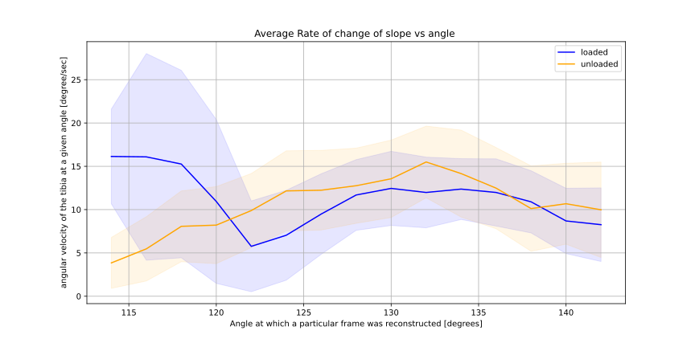
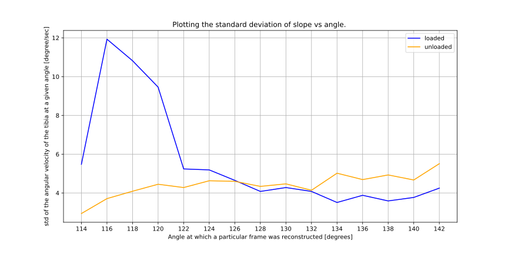

(01.12)
# first frame is Extended 

really bad frames for W. unsuable for the first 5 frames almost. 130 spokes for the fourth frame compared to 1000 spokes for frame 1 
#ROM 
NW: 114 - 142
W: 114 - 142 ... same 

- it is to be remarked that if we expect a constant 15 degree per sec angular velocity, why is it that we are not hitting that at all. 