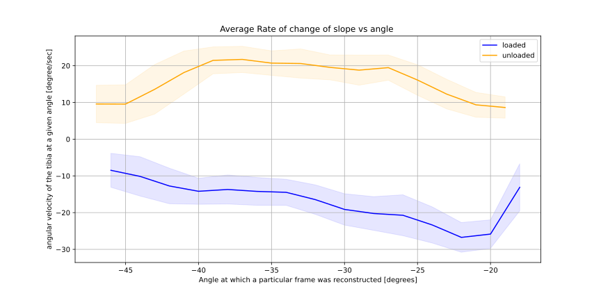
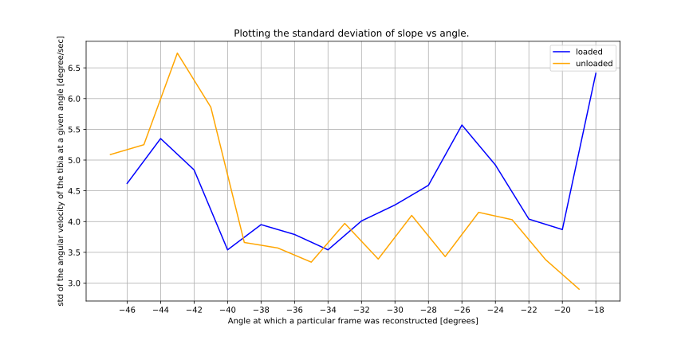
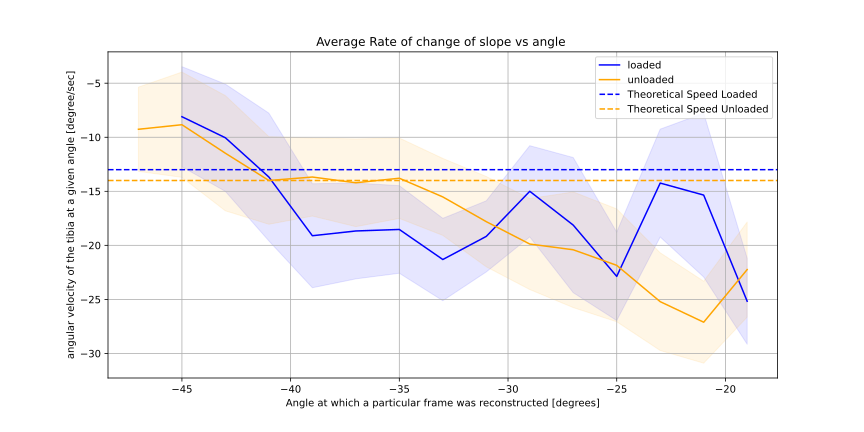
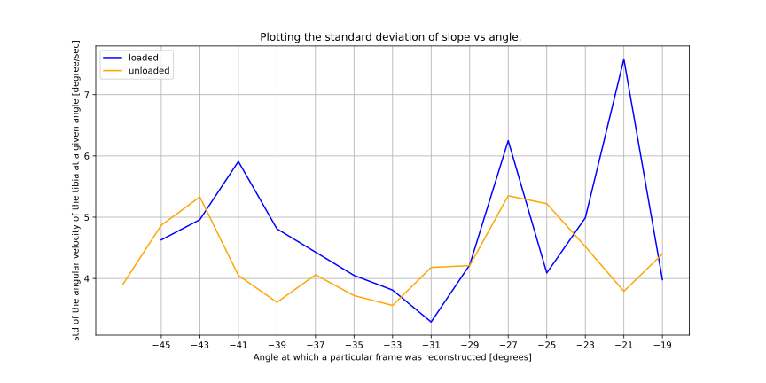

# first frame is extended -> neg should mean upwards motion 

2024-03-01 18:11:56,393 pymri        INFO     Number of detected triggers: 101
2024-03-01 18:11:56,393 pymri        INFO     Average time between triggers: 1600.8 +/- 0.4
2024-03-01 18:11:57,054 pymri        INFO     Using window width of 2.0 deg
2024-03-01 18:11:57,488 pymri        INFO     00: Reconstructing Frame using 42 spokes for angle -47 deg. Avg slope: 9.58°/s +/- 5.09°/s
2024-03-01 18:12:04,801 pymri        INFO     01: Reconstructing Frame using 255 spokes for angle -45 deg. Avg slope: 9.55°/s +/- 5.25°/s
2024-03-01 18:12:10,969 pymri        INFO     02: Reconstructing Frame using 687 spokes for angle -43 deg. Avg slope: 13.58°/s +/- 6.74°/s
2024-03-01 18:12:19,703 pymri        INFO     03: Reconstructing Frame using 751 spokes for angle -41 deg. Avg slope: 18.14°/s +/- 5.86°/s
2024-03-01 18:12:29,013 pymri        INFO     04: Reconstructing Frame using 643 spokes for angle -39 deg. Avg slope: 21.46°/s +/- 3.66°/s
2024-03-01 18:12:37,691 pymri        INFO     05: Reconstructing Frame using 633 spokes for angle -37 deg. Avg slope: 21.72°/s +/- 3.57°/s
2024-03-01 18:12:46,144 pymri        INFO     06: Reconstructing Frame using 669 spokes for angle -35 deg. Avg slope: 20.71°/s +/- 3.34°/s
2024-03-01 18:12:54,938 pymri        INFO     07: Reconstructing Frame using 665 spokes for angle -33 deg. Avg slope: 20.60°/s +/- 3.97°/s
2024-03-01 18:13:03,586 pymri        INFO     08: Reconstructing Frame using 709 spokes for angle -31 deg. Avg slope: 19.55°/s +/- 3.39°/s
2024-03-01 18:13:12,619 pymri        INFO     09: Reconstructing Frame using 735 spokes for angle -29 deg. Avg slope: 18.80°/s +/- 4.10°/s
2024-03-01 18:13:21,833 pymri        INFO     10: Reconstructing Frame using 706 spokes for angle -27 deg. Avg slope: 19.48°/s +/- 3.43°/s
2024-03-01 18:13:30,654 pymri        INFO     11: Reconstructing Frame using 855 spokes for angle -25 deg. Avg slope: 16.10°/s +/- 4.15°/s
2024-03-01 18:13:40,495 pymri        INFO     12: Reconstructing Frame using 1125 spokes for angle -23 deg. Avg slope: 12.27°/s +/- 4.03°/s
2024-03-01 18:13:52,201 pymri        INFO     13: Reconstructing Frame using 1477 spokes for angle -21 deg. Avg slope: 9.35°/s +/- 3.38°/s
2024-03-01 18:14:06,013 pymri        INFO     14: Reconstructing Frame using 1598 spokes for angle -19 deg. Avg slope: 8.62°/s +/- 2.90°/s
2024-03-01 18:14:20,086 pymri        INFO     Output data:MRIArray(
2024-03-01 18:14:20,086 pymri        INFO     	shape = (15, 528, 528)
2024-03-01 18:14:20,086 pymri        INFO     	dims = ('repetition', 'line', 'read')
2024-03-01 18:14:20,086 pymri        INFO     	type = float32
2024-03-01 18:14:20,086 pymri        INFO     	header = 10 items
2024-03-01 18:14:20,086 pymri        INFO     )
2024-03-01 18:14:20,086 pymri        INFO     Writing output to file: MK_NW_ai2_tgv_5e-2_pos_ngn.nii

- because the first frame is extended ... pos should imply that we need to reco in the neg direction to actually get the upward motion, against the gravity , which we want. 

__________________________

___________________
just comparing the pos vs the neg... the actual slope cant be compared too well because of the negative signs.. but the standard deviations can: 

its not loaded vs unloaded it is actually pos vs neg 
loaded = neg --- moving upwards 
unloaded = pos --- moving downwards 

so.. the result isnt what we expect. we expect the upwards to be more stable than downwards ... 
but this suggests that while it is true for the first 7 or 8 degrees... is the the upwards that actually has a higher std for the rest of the range of motion. 
cant conclude anything . 

_________________________
Now we are doing the loaded reco: 
2024-03-04 13:12:54,314 pymri        INFO     Number of detected triggers: 101
2024-03-04 13:12:54,315 pymri        INFO     Average time between triggers: 1600.8 +/- 0.4
2024-03-04 13:12:55,203 pymri        INFO     Using window width of 2.0 deg
2024-03-04 13:12:55,666 pymri        INFO     00: Reconstructing Frame using 162 spokes for angle -45 deg. Avg slope: -8.10°/s +/- 4.63°/s
2024-03-04 13:13:03,241 pymri        INFO     01: Reconstructing Frame using 703 spokes for angle -43 deg. Avg slope: -10.05°/s +/- 4.96°/s
2024-03-04 13:13:12,359 pymri        INFO     02: Reconstructing Frame using 957 spokes for angle -41 deg. Avg slope: -13.68°/s +/- 5.91°/s
2024-03-04 13:13:23,471 pymri        INFO     03: Reconstructing Frame using 719 spokes for angle -39 deg. Avg slope: -19.11°/s +/- 4.81°/s
2024-03-04 13:13:32,619 pymri        INFO     04: Reconstructing Frame using 737 spokes for angle -37 deg. Avg slope: -18.67°/s +/- 4.43°/s
2024-03-04 13:13:41,869 pymri        INFO     05: Reconstructing Frame using 748 spokes for angle -35 deg. Avg slope: -18.53°/s +/- 4.05°/s
2024-03-04 13:13:51,342 pymri        INFO     06: Reconstructing Frame using 643 spokes for angle -33 deg. Avg slope: -21.31°/s +/- 3.81°/s
2024-03-04 13:13:59,939 pymri        INFO     07: Reconstructing Frame using 722 spokes for angle -31 deg. Avg slope: -19.17°/s +/- 3.29°/s
2024-03-04 13:14:08,896 pymri        INFO     08: Reconstructing Frame using 920 spokes for angle -29 deg. Avg slope: -15.00°/s +/- 4.22°/s
2024-03-04 13:14:19,218 pymri        INFO     09: Reconstructing Frame using 758 spokes for angle -27 deg. Avg slope: -18.13°/s +/- 6.25°/s
2024-03-04 13:14:28,566 pymri        INFO     10: Reconstructing Frame using 600 spokes for angle -25 deg. Avg slope: -22.87°/s +/- 4.09°/s
2024-03-04 13:14:37,007 pymri        INFO     11: Reconstructing Frame using 979 spokes for angle -23 deg. Avg slope: -14.24°/s +/- 4.99°/s
2024-03-04 13:14:47,839 pymri        INFO     12: Reconstructing Frame using 900 spokes for angle -21 deg. Avg slope: -15.35°/s +/- 7.58°/s
2024-03-04 13:14:58,035 pymri        INFO     13: Reconstructing Frame using 543 spokes for angle -19 deg. Avg slope: -25.17°/s +/- 3.98°/s
2024-03-04 13:15:05,802 pymri        INFO     Output data:MRIArray(
2024-03-04 13:15:05,802 pymri        INFO     	shape = (14, 528, 528)
2024-03-04 13:15:05,802 pymri        INFO     	dims = ('repetition', 'line', 'read')
2024-03-04 13:15:05,802 pymri        INFO     	type = float32
2024-03-04 13:15:05,802 pymri        INFO     	header = 10 items
2024-03-04 13:15:05,802 pymri        INFO     )
2024-03-04 13:15:05,802 pymri        INFO     Writing output to file: MK_W_ai2_tgv_5e-2_neg_ngn.nii

_____________
since the loaded reco without any offset started at 45, had to redo the unloaded again without offset just so odd matches odd. next time, try doing loaded first as they tend to have less spokes ear ly 
2024-03-04 13:27:55,517 pymri        INFO     Using window width of 2.0 deg
2024-03-04 13:27:55,953 pymri        INFO     00: Reconstructing Frame using 43 spokes for angle -47 deg. Avg slope: -9.26°/s +/- 3.90°/s
2024-03-04 13:28:01,944 pymri        INFO     01: Reconstructing Frame using 274 spokes for angle -45 deg. Avg slope: -8.84°/s +/- 4.87°/s
2024-03-04 13:28:08,368 pymri        INFO     02: Reconstructing Frame using 815 spokes for angle -43 deg. Avg slope: -11.48°/s +/- 5.33°/s
2024-03-04 13:28:18,336 pymri        INFO     03: Reconstructing Frame using 969 spokes for angle -41 deg. Avg slope: -14.00°/s +/- 4.05°/s
2024-03-04 13:28:29,148 pymri        INFO     04: Reconstructing Frame using 1008 spokes for angle -39 deg. Avg slope: -13.68°/s +/- 3.61°/s
2024-03-04 13:28:40,391 pymri        INFO     05: Reconstructing Frame using 968 spokes for angle -37 deg. Avg slope: -14.21°/s +/- 4.06°/s
2024-03-04 13:28:51,331 pymri        INFO     06: Reconstructing Frame using 1005 spokes for angle -35 deg. Avg slope: -13.79°/s +/- 3.72°/s
2024-03-04 13:29:02,191 pymri        INFO     07: Reconstructing Frame using 886 spokes for angle -33 deg. Avg slope: -15.52°/s +/- 3.56°/s
2024-03-04 13:29:12,788 pymri        INFO     08: Reconstructing Frame using 781 spokes for angle -31 deg. Avg slope: -17.81°/s +/- 4.18°/s
2024-03-04 13:29:22,466 pymri        INFO     09: Reconstructing Frame using 692 spokes for angle -29 deg. Avg slope: -19.88°/s +/- 4.21°/s
2024-03-04 13:29:31,446 pymri        INFO     10: Reconstructing Frame using 670 spokes for angle -27 deg. Avg slope: -20.41°/s +/- 5.35°/s
2024-03-04 13:29:40,140 pymri        INFO     11: Reconstructing Frame using 635 spokes for angle -25 deg. Avg slope: -21.85°/s +/- 5.22°/s
2024-03-04 13:29:48,693 pymri        INFO     12: Reconstructing Frame using 550 spokes for angle -23 deg. Avg slope: -25.21°/s +/- 4.52°/s
2024-03-04 13:29:56,937 pymri        INFO     13: Reconstructing Frame using 506 spokes for angle -21 deg. Avg slope: -27.11°/s +/- 3.79°/s
2024-03-04 13:30:04,942 pymri        INFO     14: Reconstructing Frame using 627 spokes for angle -19 deg. Avg slope: -22.24°/s +/- 4.40°/s
2024-03-04 13:30:13,308 pymri        INFO     Output data:MRIArray(
2024-03-04 13:30:13,308 pymri        INFO     	shape = (15, 528, 528)
2024-03-04 13:30:13,308 pymri        INFO     	dims = ('repetition', 'line', 'read')
2024-03-04 13:30:13,308 pymri        INFO     	type = float32
2024-03-04 13:30:13,308 pymri        INFO     	header = 10 items
2024-03-04 13:30:13,308 pymri        INFO     )
2024-03-04 13:30:13,308 pymri        INFO     Writing output to file: MK_NW_ai2_tgv_5e-2_neg_ngn.nii
______________________________
happy to report that the std evaluation follows prediction. 

unloaded is faster as we have more data essentially. .. given this, we see that more around 5 degrees, there is a perfect overlap .. but the loaded has no overlap like this. 

aprt from a few frames, all of the times the loaded has a higher std than unloaded 

_______
doing the W reco but pos 

pmr.py reco radial_cine_2d -i data.twix -o MK_W_ai2_tgv_5e-2_pos_ngn.nii -g ../scan_data_20240301_MK_W_30bpm.dat -aw 2 -ai 2 -d pos -os 0  -zf 2 -ngn -v -e riesling-admm -ea "--sense-fov=384.0,384.0,3.0 --fov=384.0,384.0,3.0 --tgv=5e-2 --max-outer-its=4" 
2024-03-18 10:57:43,648 pymri        INFO     Loading data.twix
2024-03-18 10:57:43,648 pymri        INFO     Loading Siemens raw data from data.twix
2024-03-18 10:57:47,134 pymri        INFO     [0]: AdjCoilSens (31.80 MB)
2024-03-18 10:57:47,134 pymri        INFO     [1]: MK_Radial_W_CINE_30bpm_CGA (1207.15 MB) <---
2024-03-18 10:58:15,823 pymri        INFO     Loading recoInfo file from: data.recoInfo
2024-03-18 10:58:17,445 pymri        INFO     Number of detected triggers: 101
2024-03-18 10:58:17,445 pymri        INFO     Average time between triggers: 1600.8 +/- 0.4
2024-03-18 10:58:18,047 pymri        INFO     Using window width of 2.0 deg
2024-03-18 10:58:18,494 pymri        INFO     00: Reconstructing Frame using 190 spokes for angle -45 deg. Avg slope: 6.88°/s +/- 3.82°/s
2024-03-18 10:58:25,477 pymri        INFO     01: Reconstructing Frame using 789 spokes for angle -43 deg. Avg slope: 9.38°/s +/- 5.20°/s
2024-03-18 10:58:35,107 pymri        INFO     02: Reconstructing Frame using 891 spokes for angle -41 deg. Avg slope: 14.81°/s +/- 7.13°/s
2024-03-18 10:58:45,385 pymri        INFO     03: Reconstructing Frame using 556 spokes for angle -39 deg. Avg slope: 24.78°/s +/- 5.21°/s
2024-03-18 10:58:53,619 pymri        INFO     04: Reconstructing Frame using 512 spokes for angle -37 deg. Avg slope: 26.80°/s +/- 4.37°/s
2024-03-18 10:59:01,591 pymri        INFO     05: Reconstructing Frame using 632 spokes for angle -35 deg. Avg slope: 21.94°/s +/- 4.49°/s
2024-03-18 10:59:10,199 pymri        INFO     06: Reconstructing Frame using 644 spokes for angle -33 deg. Avg slope: 21.42°/s +/- 3.40°/s
2024-03-18 10:59:18,882 pymri        INFO     07: Reconstructing Frame using 572 spokes for angle -31 deg. Avg slope: 24.03°/s +/- 4.15°/s
2024-03-18 10:59:27,192 pymri        INFO     08: Reconstructing Frame using 637 spokes for angle -29 deg. Avg slope: 21.71°/s +/- 5.56°/s
2024-03-18 10:59:35,744 pymri        INFO     09: Reconstructing Frame using 713 spokes for angle -27 deg. Avg slope: 19.45°/s +/- 4.99°/s
2024-03-18 10:59:44,805 pymri        INFO     10: Reconstructing Frame using 630 spokes for angle -25 deg. Avg slope: 21.72°/s +/- 3.50°/s
2024-03-18 10:59:53,371 pymri        INFO     11: Reconstructing Frame using 676 spokes for angle -23 deg. Avg slope: 20.40°/s +/- 5.28°/s
2024-03-18 11:00:02,276 pymri        INFO     12: Reconstructing Frame using 1617 spokes for angle -21 deg. Avg slope: 8.58°/s +/- 5.96°/s
2024-03-18 11:00:17,261 pymri        INFO     13: Reconstructing Frame using 1821 spokes for angle -19 deg. Avg slope: 7.56°/s +/- 2.73°/s
2024-03-18 11:00:32,780 pymri        INFO     Output data:MRIArray(
2024-03-18 11:00:32,780 pymri        INFO       shape = (14, 528, 528)
2024-03-18 11:00:32,780 pymri        INFO       dims = ('repetition', 'line', 'read')
2024-03-18 11:00:32,780 pymri        INFO       type = float32
2024-03-18 11:00:32,780 pymri        INFO       header = 10 items
2024-03-18 11:00:32,780 pymri        INFO     )
2024-03-18 11:00:32,780 pymri        INFO     Writing output to file: MK_W_ai2_tgv_5e-2_pos_ngn.nii
_____________________________________________________________________

