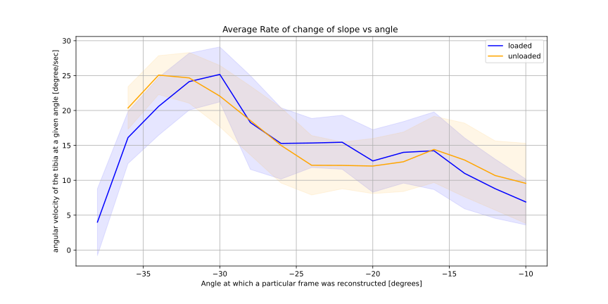
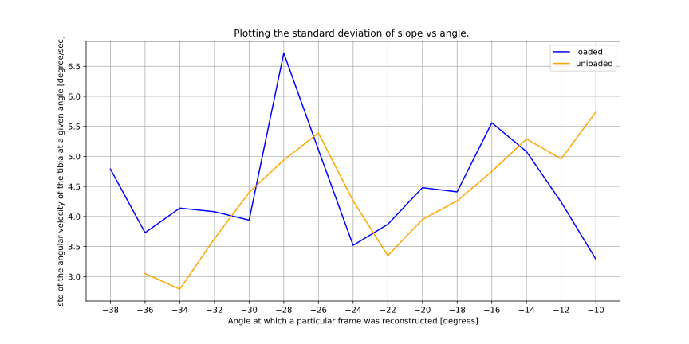

(02.02)
# first frame is flexed 
 
- also through slice motion is apparant. 
#ROM 

W: -38 to -10 
NW: -36 to -10 
Surprising point here, as one would expect NW to have a bigger ROM 

______ redo the labels!!!

remark: nothing much to differentiate between them... maybe the loaded has a spike and a drop 