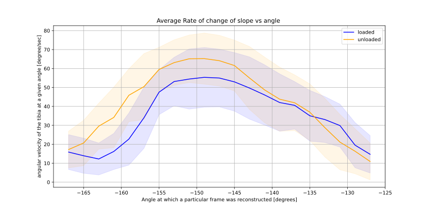
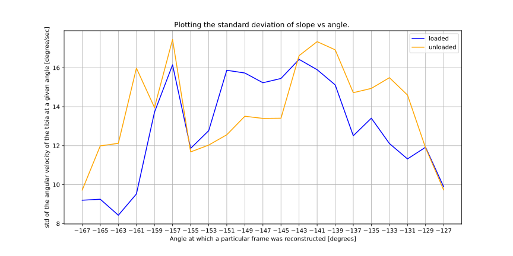

# first frame extended 

#ROM 
NW: -171 to -127 (spokes start at -165 )
W: -167 to -127 ( spokes start at -163  )

remark: this was the first measurement where we did not have the timing down, so the rate is also different here. 

_______________
Once again, because of the fact that the first frame is extended, we have to use the neg direction to obtain the upwards motion. 

2024-03-04 15:16:17,441 pymri        INFO     00: Reconstructing Frame using 15 spokes for angle -168 deg. Avg slope: -16.78°/s +/- 11.81°/s
2024-03-04 15:16:22,611 pymri        INFO     01: Reconstructing Frame using 95 spokes for angle -166 deg. Avg slope: -19.80°/s +/- 14.76°/s
2024-03-04 15:16:28,166 pymri        INFO     02: Reconstructing Frame using 292 spokes for angle -164 deg. Avg slope: -23.91°/s +/- 17.96°/s
2024-03-04 15:16:34,792 pymri        INFO     03: Reconstructing Frame using 771 spokes for angle -162 deg. Avg slope: -22.97°/s +/- 19.33°/s
2024-03-04 15:16:44,526 pymri        INFO     04: Reconstructing Frame using 797 spokes for angle -160 deg. Avg slope: -32.55°/s +/- 20.78°/s
2024-03-04 15:16:54,349 pymri        INFO     05: Reconstructing Frame using 795 spokes for angle -158 deg. Avg slope: -38.79°/s +/- 23.23°/s
2024-03-04 15:17:04,365 pymri        INFO     06: Reconstructing Frame using 630 spokes for angle -156 deg. Avg slope: -50.87°/s +/- 19.80°/s
2024-03-04 15:17:13,331 pymri        INFO     07: Reconstructing Frame using 543 spokes for angle -154 deg. Avg slope: -58.96°/s +/- 16.10°/s
2024-03-04 15:17:21,932 pymri        INFO     08: Reconstructing Frame using 552 spokes for angle -152 deg. Avg slope: -59.49°/s +/- 19.64°/s
2024-03-04 15:17:30,242 pymri        INFO     09: Reconstructing Frame using 554 spokes for angle -150 deg. Avg slope: -59.56°/s +/- 21.89°/s
2024-03-04 15:17:39,259 pymri        INFO     10: Reconstructing Frame using 524 spokes for angle -148 deg. Avg slope: -63.46°/s +/- 18.49°/s
2024-03-04 15:17:47,748 pymri        INFO     11: Reconstructing Frame using 509 spokes for angle -146 deg. Avg slope: -64.82°/s +/- 17.68°/s
2024-03-04 15:17:55,725 pymri        INFO     12: Reconstructing Frame using 501 spokes for angle -144 deg. Avg slope: -65.96°/s +/- 15.28°/s
2024-03-04 15:18:03,903 pymri        INFO     13: Reconstructing Frame using 507 spokes for angle -142 deg. Avg slope: -65.63°/s +/- 16.60°/s
2024-03-04 15:18:12,135 pymri        INFO     14: Reconstructing Frame using 510 spokes for angle -140 deg. Avg slope: -64.69°/s +/- 16.03°/s
2024-03-04 15:18:20,131 pymri        INFO     15: Reconstructing Frame using 516 spokes for angle -138 deg. Avg slope: -63.73°/s +/- 15.30°/s
2024-03-04 15:18:28,549 pymri        INFO     16: Reconstructing Frame using 542 spokes for angle -136 deg. Avg slope: -61.79°/s +/- 14.23°/s
2024-03-04 15:18:36,842 pymri        INFO     17: Reconstructing Frame using 558 spokes for angle -134 deg. Avg slope: -58.14°/s +/- 13.88°/s
2024-03-04 15:18:45,179 pymri        INFO     18: Reconstructing Frame using 673 spokes for angle -132 deg. Avg slope: -49.51°/s +/- 15.73°/s
2024-03-04 15:18:54,348 pymri        INFO     19: Reconstructing Frame using 905 spokes for angle -130 deg. Avg slope: -36.45°/s +/- 15.77°/s
2024-03-04 15:19:05,139 pymri        INFO     20: Reconstructing Frame using 1487 spokes for angle -128 deg. Avg slope: -20.05°/s +/- 14.07°/s
2024-03-04 15:19:19,379 pymri        INFO     21: Reconstructing Frame using 2007 spokes for angle -126 deg. Avg slope: -8.66°/s +/- 6.86°/s
2024-03-04 15:19:36,119 pymri        INFO     Output data:MRIArray(
2024-03-04 15:19:36,119 pymri        INFO       shape = (22, 528, 528)
2024-03-04 15:19:36,119 pymri        INFO       dims = ('repetition', 'line', 'read')
2024-03-04 15:19:36,119 pymri        INFO       type = float32
2024-03-04 15:19:36,119 pymri        INFO       header = 10 items
2024-03-04 15:19:36,119 pymri        INFO     )
2024-03-04 15:19:36,119 pymri        INFO     Writing output to file: US_W_ai2_tgv_5e-2_neg_ngn.nii

____________________
pretty crazy here.. now we go upto 128 but start 2 degress earlier.. hmmm 

2024-03-04 15:26:15,183 pymri        INFO     00: Reconstructing Frame using 50 spokes for angle -170 deg. Avg slope: -17.76°/s +/- 12.16°/s
2024-03-04 15:26:21,180 pymri        INFO     01: Reconstructing Frame using 385 spokes for angle -168 deg. Avg slope: -18.60°/s +/- 13.68°/s
2024-03-04 15:26:29,863 pymri        INFO     02: Reconstructing Frame using 789 spokes for angle -166 deg. Avg slope: -22.67°/s +/- 16.87°/s
2024-03-04 15:26:39,654 pymri        INFO     03: Reconstructing Frame using 843 spokes for angle -164 deg. Avg slope: -32.71°/s +/- 18.35°/s
2024-03-04 15:26:49,564 pymri        INFO     04: Reconstructing Frame using 738 spokes for angle -162 deg. Avg slope: -42.24°/s +/- 20.23°/s
2024-03-04 15:26:59,185 pymri        INFO     05: Reconstructing Frame using 670 spokes for angle -160 deg. Avg slope: -48.37°/s +/- 21.50°/s
2024-03-04 15:27:08,195 pymri        INFO     06: Reconstructing Frame using 580 spokes for angle -158 deg. Avg slope: -56.36°/s +/- 20.03°/s
2024-03-04 15:27:16,925 pymri        INFO     07: Reconstructing Frame using 540 spokes for angle -156 deg. Avg slope: -61.80°/s +/- 18.77°/s
2024-03-04 15:27:25,017 pymri        INFO     08: Reconstructing Frame using 509 spokes for angle -154 deg. Avg slope: -65.27°/s +/- 18.42°/s
2024-03-04 15:27:33,064 pymri        INFO     09: Reconstructing Frame using 485 spokes for angle -152 deg. Avg slope: -68.21°/s +/- 19.01°/s
2024-03-04 15:27:41,043 pymri        INFO     10: Reconstructing Frame using 462 spokes for angle -150 deg. Avg slope: -70.81°/s +/- 18.55°/s
2024-03-04 15:27:48,449 pymri        INFO     11: Reconstructing Frame using 448 spokes for angle -148 deg. Avg slope: -74.72°/s +/- 16.99°/s
2024-03-04 15:27:56,076 pymri        INFO     12: Reconstructing Frame using 426 spokes for angle -146 deg. Avg slope: -76.98°/s +/- 14.86°/s
2024-03-04 15:28:03,612 pymri        INFO     13: Reconstructing Frame using 428 spokes for angle -144 deg. Avg slope: -78.03°/s +/- 13.82°/s
2024-03-04 15:28:11,206 pymri        INFO     14: Reconstructing Frame using 427 spokes for angle -142 deg. Avg slope: -76.59°/s +/- 13.72°/s
2024-03-04 15:28:18,877 pymri        INFO     15: Reconstructing Frame using 451 spokes for angle -140 deg. Avg slope: -73.42°/s +/- 13.99°/s
2024-03-04 15:28:26,747 pymri        INFO     16: Reconstructing Frame using 481 spokes for angle -138 deg. Avg slope: -68.72°/s +/- 14.76°/s
2024-03-04 15:28:34,363 pymri        INFO     17: Reconstructing Frame using 551 spokes for angle -136 deg. Avg slope: -59.65°/s +/- 18.02°/s
2024-03-04 15:28:42,529 pymri        INFO     18: Reconstructing Frame using 719 spokes for angle -134 deg. Avg slope: -47.84°/s +/- 20.42°/s
2024-03-04 15:28:51,898 pymri        INFO     19: Reconstructing Frame using 1096 spokes for angle -132 deg. Avg slope: -31.25°/s +/- 19.86°/s
2024-03-04 15:29:03,888 pymri        INFO     20: Reconstructing Frame using 1500 spokes for angle -130 deg. Avg slope: -21.75°/s +/- 14.97°/s
2024-03-04 15:29:18,208 pymri        INFO     21: Reconstructing Frame using 1818 spokes for angle -128 deg. Avg slope: -12.05°/s +/- 10.09°/s
2024-03-04 15:29:34,212 pymri        INFO     Output data:MRIArray(
2024-03-04 15:29:34,213 pymri        INFO       shape = (22, 528, 528)
2024-03-04 15:29:34,213 pymri        INFO       dims = ('repetition', 'line', 'read')
2024-03-04 15:29:34,213 pymri        INFO       type = float32
2024-03-04 15:29:34,213 pymri        INFO       header = 10 items
2024-03-04 15:29:34,213 pymri        INFO     )
2024-03-04 15:29:34,213 pymri        INFO     Writing output to file: US_NW_ai2_tgv_5e-2_neg_ngn.nii

